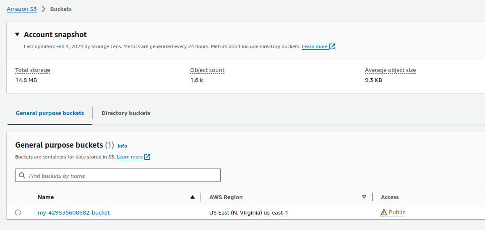
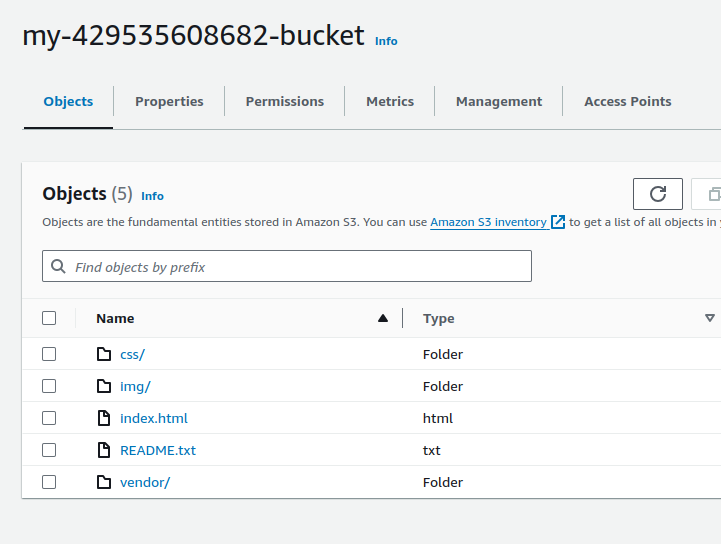

# 1-1-Project-Deploy-Static-Website-AWS


1. [Project Overview](#schema1)
2. [Website Files](#schema2)


<hr>
<a name='schema1'></a>

## 1. Project Overview


The cloud is perfect for hosting static websites that only include HTML, CSS, and JavaScript files that require 
no server-side processing. The whole project has two major intentions to implement:

- Hosting a static website on S3 and
- Accessing the cached website pages using CloudFront content delivery network (CDN) service. 
Recall that CloudFront offers low latency and high transfer speeds during website rendering.


In this project, you will deploy a static website to AWS by performing the following steps:

1. You will create a public S3 bucket and upload the website files to your bucket.
2. You will configure the bucket for website hosting and secure it using IAM policies.
3. You will speed up content delivery using AWS’s content distribution network service, CloudFront.
4. You will access your website in a browser using the unique CloudFront endpoint.


**Topics Covered:**
- S3 bucket creation
- S3 bucket configuration
- Website distribution via CloudFront
- Access website via web browser


<hr>
<a name='schema2'></a>

## 2. Website Files
- Create S3 bucket


- Upload files



- Create IAM Users
    - configura profile with cli
    ```
    aws configure --profile patri-admin
    ```
  
    - AWS Access Key ID
    - AWS Secret Access Key
    - Default region name
    - Default output format
- Secure Bucket via AIM


- Configure Bucket


- Distribute Website via CloudFront


- Access Website in Web Browser


